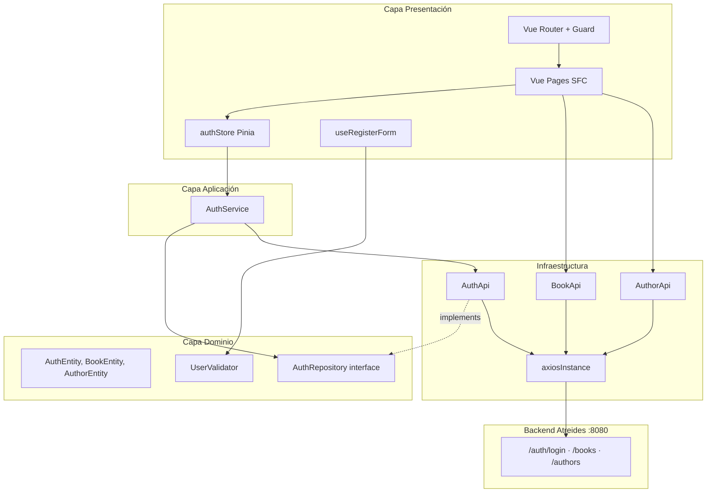

# Arquitectura de Alejandría Book

Este documento describe la arquitectura técnica del frontend de **Alejandría Book**, la biblioteca digital de la Casa Atreides. Para el contexto narrativo e histórico del proyecto, consulta [DUNE-ALEXANDRIA.md](./DUNE-ALEXANDRIA.md) y el [README](../README.md).

---

## Principios de diseño

La arquitectura sigue un enfoque **feature-based** combinado con principios de **Clean Architecture** (Arquitectura Limpia). Cada módulo de negocio (`auth`, `dashboard`) se organiza en capas con responsabilidades bien definidas, de modo que la UI no conozca los detalles del transporte HTTP y el dominio no dependa de Vue ni de Axios.

### Analogía con la Biblioteca de Alejandría y *Dune*

| Capa | Rol técnico | Paralelo narrativo |
|------|-------------|-------------------|
| **Presentation** | Vue SFC, stores, composables | La sala de lectura: donde el usuario interactúa con el catálogo |
| **Application** | Casos de uso (`AuthService`) | Los bibliotecarios: orquestan las operaciones |
| **Domain** | Entidades, interfaces, validadores | El sistema de clasificación: reglas del saber |
| **Infrastructure** | APIs HTTP, `axiosInstance` | Los mensajeros de la Casa Atreides: transportan peticiones al backend |

El backend **Atreides** es el «palacio de datos» en Arrakis: fuente de verdad remota que el frontend consulta a través del Gremio HTTP (Axios).

---

## Diagrama de capas



---

## Estructura por features

### Feature: `auth`

Implementación más madura de la arquitectura en capas.

```
auth/
├── domain/
│   ├── AuthEntity.ts       # LoginCredentials, User, AuthResponse
│   ├── UserEntity.ts       # Modelo del formulario de registro
│   ├── AuthRepository.ts   # Contrato abstracto del repositorio
│   └── validators/
│       └── UserValidator.ts
├── application/
│   └── AuthService.ts      # login(), logout(), getStoredUser()
├── infrastructure/
│   └── AuthApi.ts          # Implementación HTTP del repositorio
├── usesCases/
│   └── useRegisterForm.ts  # Composable del registro
└── presentation/
    ├── pages/
    │   ├── LoginPage.vue
    │   └── RegisterForm.vue
    └── stores/
        └── authStore.ts    # Store Pinia
```

**Flujo de login:**

```
LoginPage
  → authStore.login(credentials)
    → AuthService.login()
      → AuthRepository.login()  [AuthApi]
        → POST /auth/login
      → localStorage.setItem('auth_token', ...)
      → localStorage.setItem('auth_user', ...)
  → router.push('/dashboard')
```

### Feature: `dashboard`

Organización más ligera: las páginas consumen las APIs de infraestructura directamente.

```
dashboard/
├── domain/
│   ├── BookEntity.ts
│   └── AuthorEntity.ts
├── infrastructure/
│   ├── BookApi.ts
│   └── AuthorApi.ts
└── presentation/
    ├── layouts/
    │   └── DashboardLayout.vue
    └── pages/
        ├── DashboardOverview.vue
        ├── BooksPage.vue
        └── AuthorsPage.vue
```

> **Nota:** A medio plazo se recomienda añadir capa `application/` con servicios `BookService` y `AuthorService`, y contratos de repositorio en `domain/`, alineando dashboard con el patrón de `auth`.

---

## Infraestructura compartida

### Cliente HTTP (`axiosInstance`)

Ubicación: `src/infrastructure/http/axiosInstance.ts`

```typescript
// Configuración base
baseURL: import.meta.env.VITE_API_ATREIDES || 'http://localhost:8080'

// Interceptor de request: adjunta Bearer token
Authorization: `Bearer ${localStorage.getItem('auth_token')}`

// Interceptor de response: limpia sesión en 401
if (status === 401) localStorage.removeItem('auth_token')
```

El nombre de la variable de entorno `VITE_API_ATREIDES` refuerza la identidad del backend como servicio de la **Casa Atreides** — el guardián de los datos, análogo al Duque Leto custodiando Arrakis.

---

## Gestión de estado

### Pinia

Solo el módulo `auth` utiliza Pinia. El store `useAuthStore` expone:

| Miembro | Tipo | Descripción |
|---------|------|-------------|
| `user` | `User \| null` | Usuario autenticado |
| `token` | `string \| null` | JWT |
| `isLoading` | `boolean` | Estado de carga en login |
| `error` | `string \| null` | Mensaje de error |
| `isAuthenticated` | `computed` | `!!token` |
| `login()` | action | Delega a `AuthService` |
| `logout()` | action | Limpia storage y state |

### Estado local

`BooksPage` y `AuthorsPage` gestionan su estado con `ref`/`reactive` de Vue 3, sin stores globales. Es un patrón válido para CRUD acotado, aunque un `booksStore` podría centralizar caché si el catálogo crece — como la Biblioteca de Alejandría pasó de una sala a un complejo de salas.

---

## Enrutamiento y seguridad

### Vue Router 5

- **History mode:** `createWebHistory()` (URLs limpias sin hash)
- **Lazy loading:** todas las rutas usan `() => import(...)` para code-splitting
- **Rutas anidadas:** `/dashboard` usa `DashboardLayout` como padre

### Navigation guard

```typescript
router.beforeEach((to) => {
  const token = localStorage.getItem('auth_token')
  if (to.meta.requiresAuth && !token) {
    return { name: 'login' }
  }
})
```

**Limitaciones actuales:**
- No redirige usuarios autenticados fuera de `/login` o `/register`
- No valida expiración del JWT
- El guard lee `localStorage` directamente, no el store Pinia (posible desincronización)

En términos de *Dune*: el guard es el **escudo personal** de la biblioteca — impide el acceso sin credenciales, pero aún no distingue un token expirado de uno válido (un escudo que no detecta munición de fabricación antigua).

---

## Patrones y convenciones

### Nomenclatura de archivos

| Patrón | Ejemplo | Uso |
|--------|---------|-----|
| `*Entity.ts` | `BookEntity.ts` | Interfaces de dominio y DTOs |
| `*Api.ts` | `BookApi.ts` | Adaptadores HTTP |
| `*Service.ts` | `AuthService.ts` | Casos de uso |
| `*Repository.ts` | `AuthRepository.ts` | Contratos de persistencia |
| `*Page.vue` | `BooksPage.vue` | Páginas enlazadas a rutas |
| `*Layout.vue` | `DashboardLayout.vue` | Layouts compartidos |
| `use*.ts` | `useRegisterForm.ts` | Composables Vue |
| `*Store.ts` | `authStore.ts` | Stores Pinia |

### Convenciones de código

- **Composition API** con `<script setup lang="ts">` en todos los componentes
- **Alias `@/`** apunta a `src/` (configurado en `vite.config.ts` y `tsconfig.app.json`)
- **UI en español**: etiquetas, errores y copy de marketing
- **Paleta visual**: ámbar/naranja (pergaminos + arenas de Arrakis), bordes `rounded-xl/2xl`
- **Tailwind CSS v4** importado en `style.css` con `@import "tailwindcss"`

### Modelos de datos: convención de casing

| Origen | Convención | Ejemplo |
|--------|------------|---------|
| API backend | snake_case | `name_full`, `date_of_birth` |
| Formularios frontend | camelCase | `fullName`, `birthDate` |
| Entidades de dominio | camelCase | `publicationDate`, `birthDay` |

---

## Bootstrap de la aplicación

`src/main.ts` inicializa:

1. `createApp(App)`
2. `createPinia()` — gestión de estado
3. `MotionPlugin` — animaciones (`@vueuse/motion`)
4. `router` — enrutamiento
5. `mount('#app')`

`App.vue` es un shell mínimo con `<RouterView />`; toda la UI vive en las features.

---

## Build y despliegue

### Vite 8

- **Dev server:** HMR instantáneo
- **Build:** `vue-tsc -b` (type-check) + `vite build`
- **Output:** carpeta `dist/` lista para servir como sitio estático
- **Variables de entorno:** solo las prefijadas con `VITE_` se exponen al cliente

### TypeScript

- Configuración estricta con project references (`tsconfig.json`, `tsconfig.app.json`, `tsconfig.node.json`)
- Tipos de Vite vía `"types": ["vite/client"]`

---

## Roadmap arquitectónico

1. Unificar `dashboard` con capa `application/` y repositorios abstractos
2. Corregir carpeta `usesCases` → `useCases`
3. Conectar registro a endpoint `/auth/register`
4. Añadir `src/vite-env.d.ts` con tipado de `VITE_API_ATREIDES`
5. Sincronizar navigation guard con `authStore`
6. Introducir tests unitarios (Vitest) para dominio y servicios
7. Extraer componentes UI reutilizables (`components/shared/`)
8. Integrar Supabase Auth para autenticación
9. Migrar endpoints a Supabase Edge Functions

---

## Integración con Supabase

### Variables de entorno

```env
VITE_SUPABASE_URL=https://your-project-ref.supabase.co
VITE_SUPABASE_ANON_KEY=your-anon-key-here
```

### Uso actual

- **Auth**: El proyecto actualmente usa un backend custom (`API Atreides`) para autenticación
- **Supabase**: Está configurado para uso futuro como BaaS

### Plan de migración

1. Configurar Supabase Auth con JWT
2. Migrar tablas a PostgreSQL en Supabase
3. Configurar Row Level Security (RLS)
4. Migrar Storage para archivos multimedia

---

## Módulo de Ejercicios

### Estructura

```
exercise/
├── domain/
│   └── Exercise.ts           # Entidad Exercise
├── infrastructure/
│   ├── http/
│   │   └── axiosExercise.ts  # Instancia axios con proxy
│   └── services/
│       └── exerciseService.ts # CRUD completo
├── application/
│   └── stores/
│       └── useExerciseStore.ts
└── presentation/
    └── components/
        └── ExerciseList.vue
```

### Proxy Vite

El módulo de ejercicios usa `axiosExercise` con `baseURL: '/exercises'` que pasa por el proxy de Vite:

```typescript
// vite.config.ts
server: {
  proxy: {
    '/exercises': {
      target: 'http://localhost:8080',
      changeOrigin: true,
    }
  }
}
```

Esto evita problemas de CORS en desarrollo.

---

## Módulo de Progreso de Gladiadores (`member-progress`)

### Estructura

```
member-progress/
├── domain/
│   ├── entities/MemberProgress.types.ts   # Entidad y DTOs
│   ├── repositories/MemberProgressRepository.ts  # Contrato (port)
│   └── services/MemberProgressDomainService.ts   # Formato de mes, mapeo form→DTO
├── application/
│   ├── services/MemberProgressService.ts  # Casos de uso
│   └── stores/useMemberProgressStore.ts   # Pinia (creación y listado vía repositorio)
├── infrastructure/http/
│   └── HttpMemberProgressRepository.ts    # Adapter Axios → /progress-member
└── presentation/
    ├── components/   # Atomic Design: atoms → molecules → organisms
    └── pages/
        ├── MemberProgressListPage.vue     # Lista con Axios directo + enriquecimiento de miembros
        └── MemberProgressCreatePage.vue   # Registro mensual de avance
```

### Analogía con la Biblioteca de Alejandría

| Capa | Rol técnico | Paralelo narrativo |
|------|-------------|-------------------|
| **Presentation** | Tabla, modales, formulario | La sala de consulta donde el bibliotecario muestra las crónicas |
| **Application** | `MemberProgressService`, store Pinia | El escriba que valida y archiva cada entrada |
| **Domain** | Entidades, validaciones, formato de fechas | El sistema de clasificación: reglas de cómo se registra el avance |
| **Infrastructure** | `HttpMemberProgressRepository`, Axios | Los mensajeros que van al depósito central por los cuadernos |

### Dos formas de consultar datos en la lista

La página de listado (`MemberProgressListPage`) usa un patrón híbrido deliberado:

1. **Progreso** — Axios directo con `ref` / `onMounted` / `loading` / `error` / `list`. Como un bibliotecario que abre la sala y consulta el índice sin intermediarios.
2. **Datos del miembro** — `GET /members/{id}` con caché en `memberById`. Como la ficha de referencia cruzada: una vez consultada, queda a mano para no repetir el viaje al archivo central.

```
onMounted()
  └─ fetchProgressMember()        → GET /progress-member
  └─ loadMembersForProgress()     → GET /members/{id} (paralelo, únicos)

openDetailModal(progress)
  └─ fetchMemberById(user_id)     → caché o GET /members/{id}
```

### Proxy Vite

```typescript
// vite.config.ts
'/progress-member': { target: 'http://localhost:8080', changeOrigin: true },
'/members':         { target: 'http://localhost:8080', changeOrigin: true },
```

El proxy es el pasillo interno de la biblioteca: en desarrollo, las peticiones salen de la sala de consulta (Vite :5173) y llegan al depósito (API Atreides :8080) sin cruzar el exterior, evitando bloqueos de CORS.

---

*La arquitectura limpia es el pergamenio bien archivado: cada capa en su estante, cada dependencia apuntando hacia el dominio, no al revés.*
