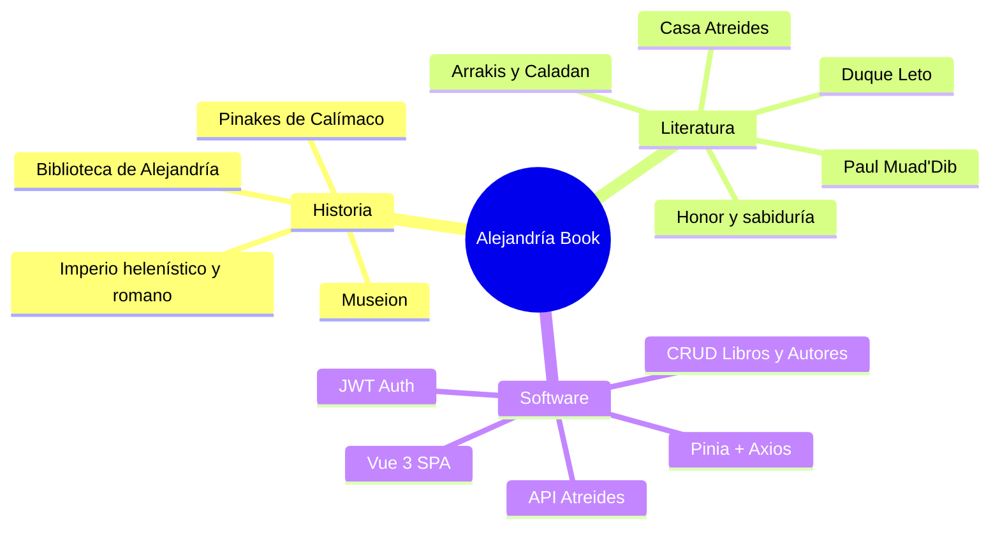

# La Biblioteca de Alejandría y la Casa Atreides: un ensayo sobre el software

Este documento explora las conexiones entre la **Biblioteca de Alejandría** del mundo antiguo, la **Casa Atreides** de la novela *Dune* de Frank Herbert, y el proyecto de software **Alejandría Book**.

---

## I. La Gran Biblioteca: el sueño de reunir todo el saber

### Orígenes históricos

La **Biblioteca de Alejandría** fue fundada en el siglo III a.C. en la ciudad homónima, bajo el reinado de Ptolomeo I Sóter. Contrario a la creencia popular de situarla exclusivamente en el «Imperio Romano», su apogeo comenzó en el periodo helenístico (Egipto ptolemaico) y continuó bajo dominio romano hasta su declive entre los siglos III y IV d.C.

Su propósito era ambicioso:

- **Recopilar** todos los textos del mundo conocido
- **Traducir** obras del griego, egipcio, hebreo y otras lenguas
- **Catalogar** con un sistema de fichas y estanterías (el *pinakes* de Calímaco es el primer índice bibliográfico conocido)
- **Investigar** en un entorno de erudición — el Museion albergaba sabios como Euclides, Arquímedes y Eratóstenes

La biblioteca no era solo un depósito: era un **motor de civilización**. Sin ella, gran parte del pensamiento antiguo se habría perdido para siempre (y de hecho, mucho se perdió a pesar de ella).

### Lecciones para el software

| Principio de Alejandría | Implementación en Alejandría Book |
|------------------------|-----------------------------------|
| Catalogar el saber | Entidades `Book` y `Author` con metadatos estructurados |
| Acceso organizado | Dashboard con secciones: vista general, libros, autores |
| Preservar contra la pérdida | Backend persistente (API Atreides) + CRUD completo |
| Clasificar por género | Arrays de `genres[]` en libros y autores |
| Registro de quién accede | Autenticación JWT y roles de usuario |

---

## II. La Casa Atreides en *Dune*: honor, cultura y responsabilidad

### Quiénes son los Atreides

En ***Dune*** (1965), la **Casa Atreides** es una Gran Casa del Imperio Landsraad. Su lema, *«Su ley es el honor»* (*"His law is honor"*), define su filosofía de gobierno.

Personajes clave:

- **Duke Leto Atreides**: gobernante justo, culto, consciente de que el poder sin sabiduría es tiranía
- **Lady Jessica**: Bene Gesserit, educada, estratega, guardiana de conocimiento secreto
- **Paul Atreides (Muad'Dib)**: heredero cuya evolución transforma el universo — el lector que se convierte en autor de la historia

### Temas de *Dune* relevantes para una biblioteca digital

#### 1. El conocimiento como poder

En el universo de *Dune*, la información es la mercancía más valiosa:

- Los **Bene Gesserit** acumulan archivos genéticos de milenios
- Los **Mentats** procesan datos como computadoras humanas
- La **Especia (*melange*)** otorga prescience — conocimiento del futuro

La Biblioteca de Alejandría tenía un objetivo similar en la Antigüedad: **centralizar el conocimiento** para que civilizaciones enteras pudieran avanzar. Alejandría Book replica esta idea en escala digital.

#### 2. La caída por traición y negligencia

La Casa Atreides pierde Arrakis por la traición del Dr. Yueh y la violencia Harkonnen. La Biblioteca de Alejandría se deterioró por incendios, conflictos y abandono.

En software, la «pérdida del saber» se manifiesta como:

- Datos sin backup
- APIs sin autenticación
- Sesiones que no expiran

Alejandría Book responde con el interceptor 401 de Axios: si las credenciales fallan, el acceso se revoca inmediatamente.

#### 3. El desierto y los pergaminos

Arrakis es un desierto hostil donde cada gota de agua cuenta. La Biblioteca de Alejandría preservaba textos frágiles de papiro en un entorno hostil (guerras, humedad, tiempo).

La paleta **ámbar y naranja** de la interfaz une ambos mundos:

- El **oro del pergamino** antiguo
- La **arena de Arrakis** bajo dos soles

---

## III. La síntesis: Alejandría Book como biblioteca Atreides

### El nombre

| Elemento | Origen | Rol en el proyecto |
|----------|--------|-------------------|
| **Alejandría** | Biblioteca histórica | Nombre de la aplicación y metáfora del catálogo |
| **Book** | Libro (inglés) | Dominio principal: gestión de obras |
| **Atreides** | Casa noble de *Dune* | Nombre del backend (`VITE_API_ATREIDES`) |
| **alajandria-book** | Nombre del paquete npm | Identificador técnico del repositorio |

La variante ortográfica «Alajandria» (con *j*) en el nombre del paquete y «Alejandria» (sin *j*) en la UI reflejan la evolución lingüística del topónimo: de la ciudad macedonia a la metáfora universal de saber.

### Mapa conceptual

---

## IV. Comparativa detallada: tres universos, una misión

### Personajes y roles técnicos

| Figura | Universo | Rol en Alejandría Book |
|--------|----------|------------------------|
| Calímaco | Historia — creador del *pinakes* | `BookEntity`, `AuthorEntity`: esquemas de catalogación |
| Euclides / Eratóstenes | Historia — eruditos del Museion | Desarrolladores que extienden el catálogo |
| Duque Leto Atreides | *Dune* — gobernante honorable | `AuthService`: reglas de acceso justas |
| Dr. Yueh | *Dune* — traidor | Vulnerabilidades de seguridad (401, tokens) |
| Paul Atreides | *Dune* — el que ve el futuro | `DashboardOverview`: visión panorámica del catálogo |
| Thufir Hawat | *Dune* — Mentat, maestro de espías | `axiosInstance`: analiza y enruta cada petición |
| Gurney Halleck | *Dune* — maestro de armas y cultura | `DashboardLayout`: estructura y navegación |
| Bibliotecario anónimo | Historia | El usuario autenticado que mantiene el catálogo |

### Lugares y componentes

| Lugar | Universo | Componente software |
|-------|----------|-------------------|
| Salas de pergaminos | Alejandría | `BooksPage` — estantería digital |
| Registro de autores | Alejandría | `AuthorsPage` — quién escribió qué |
| Palacio de Arrakeen | *Dune* | Backend Atreides en `:8080` |
| Puerta de acceso | Ambos | `LoginPage` / `RegisterForm` |
| Sala del consejo | *Dune* | `DashboardOverview` — métricas y decisiones |

### Conceptos de *Dune* y su reflejo técnico

| Concepto en *Dune* | Descripción | Equivalente técnico |
|--------------------|-------------|---------------------|
| **Kwisatz Haderach** | El que puede estar en muchos lugares a la vez | SPA Vue: una app, múltiples vistas (router) |
| **Prescience** | Ver posibles futuros | Dashboard con KPIs y tendencias |
| **Bene Gesserit** | Orden que preserva linajes y secretos | `localStorage` + JWT: memoria de sesión |
| **Gremio Espacial** | Monopolio del viaje interestelar | Axios: canal único de comunicación con el backend |
| **Las Arenas del Tiempo** | Desierto que lo consume todo | Datos sin respaldo se pierden; el CRUD preserva |
| **Weirding Way** | Arte marcial atreides | Clean Architecture: cada capa con su función |
| **Agua de la vida** | Sustancia transformadora | Conocimiento transformador de los libros del catálogo |

---

## V. Citas de *Dune* y su resonancia en el proyecto

> *«Deep in the human unconscious is a pervasive need for a logical universe that makes sense. But the real universe is always one step beyond logic.»*  
> — Frank Herbert, *Dune*

La arquitectura del software intenta imponer **lógica** (capas, tipos, contratos) sobre un dominio que evoluciona (nuevos géneros, autores, formatos). Como en *Dune*, el sistema debe adaptarse sin perder su honor estructural.

> *«A beginning is the time for taking the most delicate care that the balances are correct.»*  
> — Prólogo de *Dune*

La fase 0.0.0 del proyecto es ese «tiempo de inicio»: sentar las bases arquitectónicas (auth completo, dashboard en progreso) antes de escalar.

> *«The mystery of life isn't a problem to solve, but a reality to experience.»*  
> — Frank Herbert, *Dune*

Una biblioteca no es solo una base de datos: es una **experiencia** de descubrimiento. El frontend Vue con animaciones (`@vueuse/motion`) y diseño cuidado busca que gestionar libros no sea una tarea burocrática, sino un acto de curaduría.

---

## VI. El usuario como miembro de la Casa

Cuando un usuario inicia sesión en Alejandría Book, no es un visitante anónimo en las calles de Arrakis. Es un **miembro de la Casa Atreides** con credenciales verificadas:

1. Presenta sus credenciales en `/login` (como un emisario ante el Duque)
2. Recibe un token JWT (su anillo de autoridad)
3. Accede al dashboard (el archivo de la biblioteca)
4. Gestiona libros y autores (custodia activa del saber)
5. Cierra sesión con `logout()` (deja el archivo bajo llave)

El registro (`/register`) representa la **incorporación de nuevos miembros** a la casa — actualmente en fase de iniciación (validación local, sin juramento ante el backend).

---

## VII. Conclusión: por qué esta unión tiene sentido

La Biblioteca de Alejandría y la Casa Atreides parecen mundos aparte — uno histórico, otro ficticio. Pero comparten una **misión fundamental**:

> **Custodiar el conocimiento y ponerlo al servicio de quienes lo necesitan, con integridad y responsabilidad.**

Alejandría Book es la encarnación digital de esa misión:

- De **Alejandría** toma la vocación enciclopédica: catalogar libros y autores
- De los **Atreides** toma el honor en el acceso: autenticación, API nombrada, diseño que inspira respeto por el saber
- De ***Dune*** toma la advertencia: el conocimiento mal custodiado se pierde, y el poder sin ética corrompe

El código es el nuevo pergamino. El backend Atreides es el nuevo palacio. Y cada usuario que inicia sesión es, por un momento, bibliotecario de la gran casa del saber.

---

*«I must not fear. Fear is the mind-killer.»* — Frank Herbert, *Dune*

*Pero el bibliotecario debe temer la pérdida de un solo volumen. Por eso existe el CRUD.*
